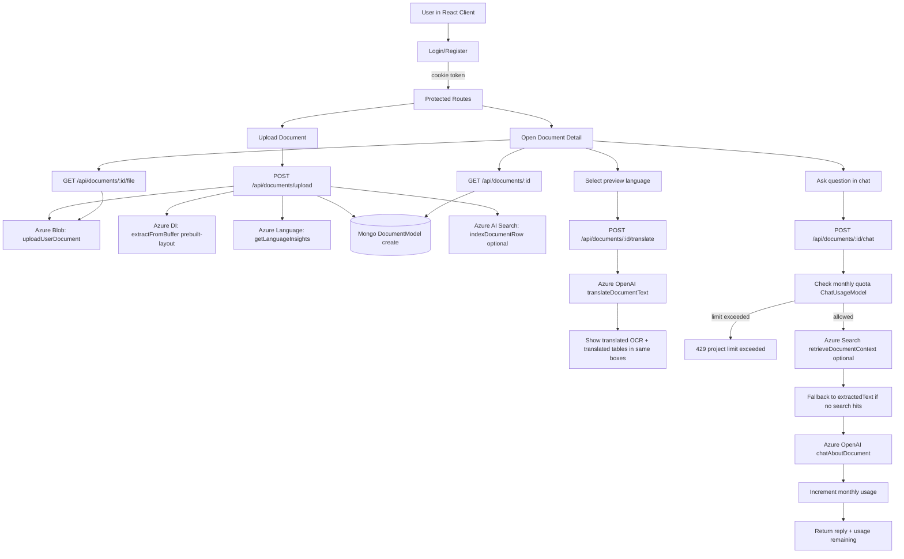

# DocLens AI — End-to-End Implementation Guide (Current State)

This document is the source of truth for:
- Full project flow (auth -> upload -> extraction -> insights -> translation -> chat -> quota)
- Which function handles each step
- Which Azure service is used where
- Practical roadmap for stronger market fit at minimal cost

---

## 1) Current capabilities

| Capability | API / UI | Key functions | Azure service |
|---|---|---|---|
| Auth (cookie JWT) | `/api/auth/*` + React auth pages | `requireAuth`, auth controllers/services | None |
| Document upload | `POST /api/documents/upload` | `uploadMiddleware`, `uploadDocument`, `uploadUserDocument` | Azure Blob Storage |
| OCR + layout extraction | upload pipeline | `extractFromBuffer` | Azure Document Intelligence (`prebuilt-layout`) |
| Language insights | upload pipeline + detail UI | `getLanguageInsights` | Azure AI Language (Text Analytics) |
| Document listing/details | `GET /api/documents`, `GET /api/documents/:id` | `listDocuments`, `getDocument` | MongoDB only |
| Original file preview | `GET /api/documents/:id/file` | `getDocumentFile`, `downloadUserDocument` | Azure Blob Storage |
| OCR/table translation in-place | selector on `DocumentDetailPage` | `translateDocument`, `translateDocumentText` | Azure OpenAI (translation prompt) |
| Grounded document chat | `POST /api/documents/:id/chat` | `chatDocument`, `retrieveDocumentContext`, `chatAboutDocument` | Azure AI Search (optional), Azure OpenAI |
| Monthly chat quota | chat panel + backend enforcement | `getChatUsage`, `ChatUsageModel`, quota checks in `chatDocument` | None |

---

## 2) End-to-end flow diagram



---

## 3) Function-level map (backend)

## `src/controllers/documents.controller.ts`
- `uploadMiddleware`: `multer.single("file")`
- `uploadDocument`:
  - validates file type/size
  - uploads original to Blob
  - calls OCR extraction + language insights
  - persists Mongo document
  - optional Azure Search row index
- `listDocuments`: metadata-only list for current user
- `getDocument`: full detail (`extractedText`, `keyValuePairs`, `tablesPreview`, insights)
- `getDocumentFile`: downloads blob and streams to browser preview
- `translateDocument`: translates OCR + tables preview for selected target language
- `chatDocument`:
  - checks monthly quota
  - retrieves search snippets (optional)
  - falls back to local OCR context
  - calls chat completion
  - increments usage and returns remaining quota
- `getChatUsage`: returns current month usage snapshot

## `src/services/documentExtractor.ts`
- `extractFromBuffer(buffer)`:
  - uses Document Intelligence `prebuilt-layout`
  - tries `keyValuePairs` feature and falls back gracefully on invalid argument
  - returns `text`, `keyValuePairs`, `tablesPreview`

## `src/services/languageInsights.ts`
- `getLanguageInsights(text)`:
  - detect language
  - extract key phrases
  - recognize entities
  - returns structured insight object

## `src/services/documentChat.ts`
- `chatAboutDocument(documentContext, userMessage, replyLanguage)`
- `translateDocumentText(text, targetLanguage)`

## `src/services/searchIndex.ts`
- `indexDocumentRow(doc)` for optional indexing
- `retrieveDocumentContext(query, userId, documentId)` for keyword retrieval

## Models
- `src/models/Document.model.ts`: extracted content + insights storage
- `src/models/ChatUsage.model.ts`: per-user monthly chat counters with unique index

---

## 4) Function-level map (frontend)

## `docuwise-ai-client/src/pages/DocumentDetailPage.tsx`
- Shows:
  - original file preview
  - OCR preview box
  - tables preview box
  - key-value + language insights
  - chat + quota badge
- Translation behavior:
  - language selector next to OCR and tables headings
  - default English shows original text
  - non-English calls translate API and replaces text in same boxes

## `docuwise-ai-client/src/store/apiSlice.ts`
- `getDocument`
- `chatDocument` (supports `replyLanguage`)
- `getChatUsage`
- `translateDocument`

## `docuwise-ai-client/src/App.tsx` + `src/i18n.tsx`
- UI language selector (EN/HI) for interface labels
- Separate from document content translation

---

## 5) Azure service usage map

| Azure service | Why used | Where in code | Cost notes |
|---|---|---|---|
| Azure Blob Storage | Store raw uploaded files | `services/azureBlob.ts` + `getDocumentFile` | Low cost, use lifecycle rules |
| Azure Document Intelligence | OCR/layout, key-value/tables extraction | `services/documentExtractor.ts` | F0 has strict limits, good for prototyping |
| Azure AI Language | Language detection, key phrases, entities | `services/languageInsights.ts` | Optional; keep enabled selectively |
| Azure OpenAI | Chat grounded on doc + translation | `services/documentChat.ts` | Primary cost driver; quota cap added |
| Azure AI Search (optional) | Keyword retrieval context for chat | `services/searchIndex.ts` | Free tier good for MVP keyword RAG |

---

## 6) Environment variables (server)

Use `docuwise-ai-server/.env.example` and set:

### Required core
- `MONGODB_URI`
- `JWT_SECRET`
- `PORT`
- `CLIENT_URL`

### Required for document pipeline
- `AZURE_STORAGE_CONNECTION_STRING`
- `AZURE_DOCUMENT_INTELLIGENCE_ENDPOINT`
- `AZURE_DOCUMENT_INTELLIGENCE_KEY`
- `AZURE_OPENAI_ENDPOINT`
- `AZURE_OPENAI_API_KEY`
- `AZURE_OPENAI_DEPLOYMENT_CHAT`
- `AZURE_OPENAI_API_VERSION`

### Optional but recommended
- `AZURE_LANGUAGE_ENDPOINT`
- `AZURE_LANGUAGE_KEY`
- `AZURE_SEARCH_ENDPOINT`
- `AZURE_SEARCH_ADMIN_KEY`
- `AZURE_SEARCH_INDEX_NAME`

### Cost control
- `MONTHLY_CHAT_LIMIT=20` (or `10` for stricter cap)

---

## 7) API reference (authenticated)

| Method | Path | Purpose |
|---|---|---|
| `GET` | `/api/documents` | List current user docs |
| `GET` | `/api/documents/:id` | Full doc detail + insights |
| `GET` | `/api/documents/:id/file` | Stream raw file for preview |
| `POST` | `/api/documents/upload` | Upload and process file |
| `POST` | `/api/documents/:id/translate` | Translate OCR + tables preview |
| `POST` | `/api/documents/:id/chat` | Ask document-grounded question |
| `GET` | `/api/documents/chat/limit` | Monthly usage snapshot |

---

## 8) Cost optimization checklist (minimal budget)

1. Keep `MONTHLY_CHAT_LIMIT` small (`10`-`20`) per user.
2. Use `gpt-4o-mini` (already in use) for translation and chat.
3. Keep retrieval keyword-first via free Azure Search (avoid vector costs initially).
4. Cache translation result per `(documentId + language)` in Mongo to avoid repeated OpenAI calls.
5. Reduce translated context size (already partially capped).
6. Run AI Language insights only on first upload (already aligned).
7. Add rate limiting for upload and chat endpoints in production.

---

## 9) Is this project meaningful by market standard?

Short answer: **Yes, meaningful for 2026 MVP market**.

Why:
- Solves a real workflow: upload -> extract -> understand -> ask -> translate.
- Uses practical enterprise stack (MERN + Azure AI).
- Includes security basics (auth, user-level ownership checks).
- Includes cost-safety controls (monthly chat cap), which many prototypes miss.
- Good fit for SMB/internal automation use cases (invoice reading, operations back-office, compliance checks).

Current maturity level:
- **Strong MVP / portfolio-ready**
- Not yet enterprise-ready for regulated production without additional controls (audit trails, observability, PII handling, retry/idempotency, async processing).

---

## 10) High-impact improvements (vast scope, minimal cost)

### A. Product value (highest ROI)
1. Add structured extraction templates (invoice fields: vendor, invoice no, due date, totals).
2. Add export actions (JSON/CSV) for accounting workflow.
3. Save chat history per document for continuity.

### B. Trust + quality
1. Add source citations in chat reply (which snippet/section answered it).
2. Add confidence indicators for extracted fields.
3. Add human correction UI and persist corrected values.

### C. Cost + scale
1. Translation cache (document + language) to prevent repeated spend.
2. Async processing queue for uploads (better UX and resilience).
3. Add per-user and per-IP rate limits.

### D. GTM-ready packaging
1. Team workspace + role-based access.
2. Stripe metering (free tier + paid chat/translation quota).
3. Simple admin dashboard: usage, top docs, failure reasons.

---

## 11) Recommended next sprint plan (low cost)

Week 1:
- Translation cache in Mongo
- Chat citation response format
- Better error taxonomy for user messages

Week 2:
- Structured invoice schema extractor
- CSV export
- Basic analytics page (usage + quota remaining)

Week 3:
- Async job queue for upload pipeline
- Retry policies and dead-letter logging
- Basic observability (request IDs + timing logs)

---

## 12) Production readiness notes

- Keep `.env` out of git.
- Use private Blob container and signed access patterns.
- Move secrets to Azure Key Vault.
- Restrict CORS to exact production origin.
- Add audit logging for document access and chat events.
- Add data retention policy and user data deletion flow.

---

*Update this document whenever endpoints, env contracts, or AI orchestration behavior changes.*
# DocLens AI — Phase 2 implementation guide

This document explains **what was built**, **how the pieces connect**, and **how to configure Azure + run everything** step by step. It mirrors your “Day 0” Azure portal plan and maps it to this repo’s code.

---

## 1. What this phase delivers

| Capability | Where it lives |
|------------|----------------|
| **Upload** PDF / images (multipart) | `POST /api/documents/upload` — `documents.controller.ts` + `multer` |
| **Store raw file** in Azure Blob (`documents` container, path `{userId}/{uuid}-{filename}`) | `services/azureBlob.ts` |
| **Extract** layout text, optional key-value pairs, table preview | `services/documentExtractor.ts` — Azure **Document Intelligence** model `prebuilt-layout` + feature `keyValuePairs` |
| **Persist metadata + OCR text** in MongoDB | `models/Document.model.ts` |
| **List / fetch** own documents | `GET /api/documents`, `GET /api/documents/:id` |
| **Chat** grounded in extracted text | `POST /api/documents/:id/chat` — `services/documentChat.ts` — **Azure OpenAI** (`AzureOpenAI` from `openai`, deployment from env) |
| **Optional search index** row upsert | `services/searchIndex.ts` — Azure **AI Search** (only if env vars set; failures are swallowed) |
| **React UI** | `docuwise-ai-client`: route `/documents`, `DocumentsPage.tsx`, RTK Query in `store/apiSlice.ts` |

**Not in this phase (future work):** Translator multi-language UI, Computer Vision as a separate path, full Cognitive Search query API from the client, PDF viewer with highlight overlays, streaming chat.

---

## 2. Prerequisites

1. **Node.js** (LTS) on your machine.  
2. **MongoDB Atlas** (M0 free is fine) — same as Phase 1.  
3. **Azure subscription** — follow your checklist for: Resource Group, Document Intelligence (F0), Azure OpenAI (S0 + model deployment), Storage account + container, optional AI Search (Free).  
4. **Cost guard** — create an Azure **Budget** (e.g. $5 at 80% email alert) as in your notes.

---

## 3. Azure portal — quick mapping to env vars

Do these in Azure Portal (order can match your Day 0 doc). After each resource, copy values into **server** `.env` (see `.env.example`).

### 3.1 Document Intelligence (Form Recognizer)

1. Create resource → **Keys and Endpoint**.  
2. Set in `.env`:

```env
AZURE_DOCUMENT_INTELLIGENCE_ENDPOINT=https://YOUR-NAME.cognitiveservices.azure.com
AZURE_DOCUMENT_INTELLIGENCE_KEY=YOUR_KEY_1
```

Use the **endpoint URL** without a trailing slash (the code trims if you add one).

### 3.2 Azure OpenAI

1. Create Azure OpenAI resource.  
2. **Model deployments** → deploy **gpt-4o-mini** (or gpt-4o); note the **deployment name** exactly.  
3. **Keys and Endpoint** → endpoint + key.

```env
AZURE_OPENAI_ENDPOINT=https://YOUR-RESOURCE.openai.azure.com
AZURE_OPENAI_API_KEY=YOUR_KEY
AZURE_OPENAI_DEPLOYMENT_CHAT=gpt-4o-mini
AZURE_OPENAI_API_VERSION=2024-02-01
```

If chat fails with API version errors, try `2024-08-01-preview` or the version shown in Azure docs for your region.

### 3.3 Blob Storage

1. Storage account → **Access keys** → copy **Connection string**.  
2. **Containers** → create container named **`documents`** (the code calls `createIfNotExists`, but creating it manually is fine).  
3. Set:

```env
AZURE_STORAGE_CONNECTION_STRING=DefaultEndpointsProtocol=...
```

### 3.4 (Optional) Azure AI Search

1. Create **Azure AI Search** (Free tier where available).  
2. **Keys** → admin key + URL.  
3. **Create search index** before uploads will succeed indexing (otherwise merge is skipped / errors ignored). Minimal JSON schema the code expects:

| Field name | Type | Attributes |
|------------|------|------------|
| `id` | Edm.String | **Key** |
| `documentId` | Edm.String | filterable |
| `userId` | Edm.String | filterable |
| `title` | Edm.String | searchable |
| `content` | Edm.String | searchable |

Index name must match `.env`:

```env
AZURE_SEARCH_ENDPOINT=https://YOUR-SERVICE.search.windows.net
AZURE_SEARCH_ADMIN_KEY=YOUR_ADMIN_KEY
AZURE_SEARCH_INDEX_NAME=doclens-docs
```

If these are omitted, **upload and chat still work**; only the search upsert is skipped.

---

## 4. Server environment variables

Copy `docuwise-ai-server/.env.example` → `.env` and fill:

- **Always required (Phase 1):** `MONGODB_URI`, `JWT_SECRET`, `PORT`, `CLIENT_URL`  
- **Required for uploads + chat:** `AZURE_STORAGE_CONNECTION_STRING`, `AZURE_DOCUMENT_INTELLIGENCE_ENDPOINT`, `AZURE_DOCUMENT_INTELLIGENCE_KEY`, `AZURE_OPENAI_ENDPOINT`, `AZURE_OPENAI_API_KEY`  
- **Optional:** Search vars above; tweak `AZURE_OPENAI_DEPLOYMENT_CHAT` / `AZURE_OPENAI_API_VERSION`

If Azure vars are missing, `POST /api/documents/upload` returns **503** with a message pointing to this doc.

---

## 5. How to run locally

### 5.1 API server

```bash
cd docuwise-ai-server
npm install
npm run dev
```

Default: `http://localhost:3001` (or `PORT` in `.env`).

### 5.2 Client

```bash
cd docuwise-ai-client
# .env → VITE_API_URL=http://localhost:3001   (no /api suffix; client adds /api prefix — see client getApiBaseUrl)
npm install
npm run dev
```

1. Register / login.  
2. Open **Documents** in the nav (or **Go to Documents** on the dashboard).  
3. Drag a **PDF** or image → wait for upload (Blob + Document Intelligence can take **10–60s** on first call).  
4. Click a row → view extracted text + key-values + table preview → use **Chat with this document**.

---

## 6. API reference (authenticated)

All routes use the **HTTP-only cookie** `token` (same as `/api/auth/*`). Send requests with `credentials: 'include'` (the React app already does).

| Method | Path | Description |
|--------|------|--------------|
| `GET` | `/api/documents` | List current user’s documents (metadata only). |
| `GET` | `/api/documents/:id` | Full document including `extractedText`, `keyValuePairs`, `tablesPreview`. |
| `POST` | `/api/documents/upload` | `multipart/form-data` field name **`file`**. Max 16 MB. |
| `POST` | `/api/documents/:id/chat` | JSON `{ "message": "your question" }` → `{ "reply": "..." }`. |

**Route order note:** `POST /upload` is registered **before** `GET /:id` so `"upload"` is never captured as an id.

---

## 7. Code map (where to extend)

| Topic | Files |
|-------|--------|
| Auth on document routes | `middleware/requireAuth.ts`, `types/express.d.ts` |
| Mongo schema | `models/Document.model.ts` — add fields for pages, language, custom models, etc. |
| DI model / features | `services/documentExtractor.ts` — change `prebuilt-layout` or add `prebuilt-read` / custom model id |
| Chat prompt / model params | `services/documentChat.ts` |
| Blob path / container | `services/azureBlob.ts` |
| Search document shape | `services/searchIndex.ts` + index definition in Azure |
| HTTP wiring | `routes/documents.routes.ts`, `controllers/documents.controller.ts`, `app.ts` |
| Client API | `docuwise-ai-client/src/store/apiSlice.ts` |
| Client UI | `docuwise-ai-client/src/pages/DocumentsPage.tsx` |

---

## 8. MERN + Azure alignment (recruiter-style)

- **MongoDB:** Stores per-user document records (filename, blob path, extracted text cap ~900k chars, key-value array, table preview).  
- **Express:** REST endpoints, multer upload, orchestrates Blob → Document Intelligence → Mongo → optional Search.  
- **React:** Ant Design **Upload.Dragger**, **Table**, detail card, chat; state via **Redux Toolkit Query** (same `api` slice as auth).  
- **Azure:** Document Intelligence (AI-102 skill area), OpenAI deployment, Blob storage; optional Cognitive Search for “search across docs” foundation.

---

## 9. Troubleshooting

| Symptom | Things to check |
|---------|-------------------|
| 503 on upload | All five core Azure env vars set; restart server after `.env` change. |
| 401 on `/api/documents` | Logged in? Cookie blocked? `CLIENT_URL` must match Vite origin for CORS + credentials. |
| Document Intelligence timeout / 429 | F0 quota; retry later; reduce file size / pages. |
| OpenAI 404 | Deployment name must match `AZURE_OPENAI_DEPLOYMENT_CHAT` exactly. |
| OpenAI 401 | Wrong key or endpoint. |
| Blob failure | Connection string; container name `documents`; network. |
| Mongo too large | Very large PDFs are text-capped in `Document.model.ts` (`capExtractedText`). |

---

## 10. Suggested next milestones

1. **Search:** Client search box calling a new `GET /api/documents/search?q=` backed by Azure AI Search.  
2. **Translator:** Post-extract or on-chat path using `@azure/ai-text-analytics` / Translator REST.  
3. **Streaming chat:** SSE or WebSocket from OpenAI streaming API.  
4. **Highlights:** Store paragraph bounding boxes from DI result in Mongo + map to PDF.js viewer.

---

## 11. Security notes (production)

- Never commit `.env`.  
- Restrict CORS `CLIENT_URL` to your real production origin.  
- Prefer **private** Blob containers + **SAS** or **user delegation** for downloads instead of public blob access (current code uploads only; add signed read URLs for downloads later).  
- Rate-limit `upload` and `chat` per user to control cost.  
- Rotate keys via Key Vault in production.

---

*Generated for the DocLens AI codebase. Update this file when you add endpoints or change env contracts.*
